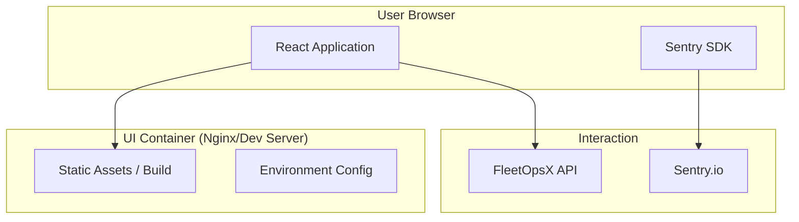

# HLD – UI Infrastructure Overview

## Document Information

| Field | Value |
|-------|-------|
| **Feature Name** | UI Infrastructure & Dockerization |
| **Status** | Approved |
| **Version** | 1.0 |
| **Date** | 2025-12-25 |
| **Author** | Antigravity |
| **Reference** | Epic P1-E1 |

---

## 1. Executive Summary

This document outlines the high-level design for the FleetOpsX UI infrastructure. The goal is to provided a containerized, production-ready React application that integrates with the backend API and includes observability.

---

## 2. System Architecture

### 2.1 Components

- **React / Vite**: Core frontend framework and build tool.
- **Nginx (Production)**: Used in the production stage of the Docker build to serve static assets efficiently.
- **Sentry SDK**: Integrated into the entry point for real-time error reporting and performance monitoring.
- **Environment Variables**: Managed via Vite's `import.meta.env` for API URLs and DSNs.

---

## 3. Data Flow

1. **Initialization**: Application loads; Sentry is initialized based on environment variables.
2. **API Interaction**: React components use TanStack Query/Axios to communicate with the Backend API.
3. **Error Reporting**: Unhandled exceptions or manual captures are sent to Sentry.
4. **Build Process**: Multi-stage Docker build optimizes the final bundle size.

---

## 4. Security Considerations

- **Environment Exposure**: Only variables prefixed with `VITE_` are exposed to the browser.
- **Content Security Policy**: To be defined for script and style source restrictions.

---

## 5. Deployment strategy

- **Dockerization**: Provided via a multi-stage `Dockerfile`.
- **Hosting**: Served as static assets behind an Nginx reverse proxy in production environments.
