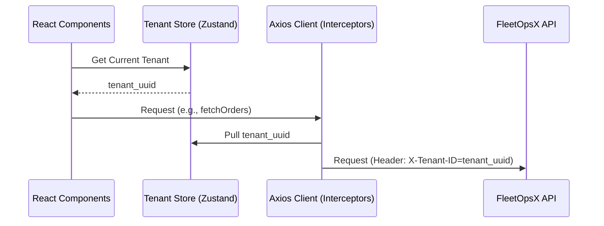

# HLD – UI Multi-Tenancy Integration

## Document Information

| Field | Value |
|-------|-------|
| **Feature Name** | UI Multi-Tenant Foundations (P1-E2) |
| **Status** | Draft |
| **Version** | 1.0 |
| **Date** | 2025-12-25 |
| **Author** | Antigravity |
| **Reference** | Blueprint Section 6 |

---

## 1. Executive Summary

This document describes how the FleetOpsX UI handles multi-tenancy. The UI is responsible for identifying the current tenant and ensuring all API requests include the correct `X-Tenant-ID` header to maintain data isolation.

---

## 2. Architecture & Design

### 2.1 Tenant Selection/Resolution

In Phase 1, the tenant will be resolved via:
1.  **Configuration**: A default tenant ID in environment variables for local development.
2.  **State**: A global state store (Zustand) that holds the active `tenantId`.

### 2.2 Request Interception

All API requests made via `apiClient` (Axios) will be intercepted to inject the tenant header.

---

## 3. Component Interactions

-   **TenantProvider/Wrapper**: A top-level component that ensures a tenant is selected before the app renders (or uses a default).
-   **TenantSwitcher (Optional for P1)**: A UI component allowing an Ops Manager to switch between managed tenants.

---

## 4. Security Considerations

-   **Isolation**: The UI must never "guess" tenant IDs. It should only use the ID associated with the authenticated user (Phase 2) or the explicitly selected tenant.
-   **Validation**: The API remains the source of truth; if an invalid `X-Tenant-ID` is passed, the API will return a `403 Forbidden` or `404 Not Found`.
