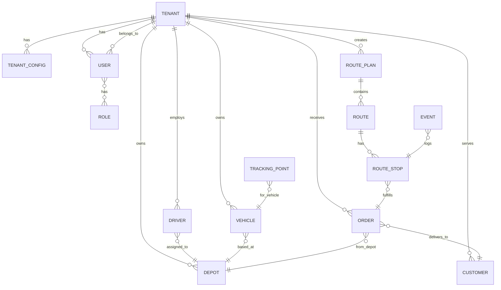

# FleetOpsX – Architecture & System Design

This document details the architectural decisions, component interactions, and evolution path for FleetOpsX.
It is intended for the engineering team to understand the system structure, data flow, and deployment strategy.

---

## 1. High-Level System Context

Use this as the top diagram in your architecture doc.

```mermaid
flowchart LR
    subgraph Clients
        OpsUI[Ops Web App\n(React)]
        DriverApp[Driver App\n(React Native / Web)]
        AdminUI[Admin Panel\n(React)]
    end

    subgraph Backend["FleetOpsX Backend (FastAPI Monolith)"]
        APIGW[API Gateway & Routers]
        Auth[Auth & Tenant Resolver]
        OrdersSvc[Orders Service]
        FleetSvc[Fleet Service\n(Drivers/Vehicles)]
        CalendarSvc[Calendar & Shifts]
        PlanningSvc[Planning & Optimization]
        TrackingSvc[Tracking Service]
        NotifySvc[Notification Service]
    end

    subgraph Data["Data & Infra"]
        DB[(Postgres + PostGIS)]
        Cache[(Redis)]
        MQ[[Message Queue\n(Redis / future Kafka)]]
    end

    subgraph External["External Integrations"]
        Maps[Maps & Routing API]
        Comm[SMS/Email/WhatsApp Providers]
        ERP[ERP / WMS / TMS Systems]
    end

    Clients --> APIGW
    APIGW --> Auth
    APIGW --> OrdersSvc
    APIGW --> FleetSvc
    APIGW --> CalendarSvc
    APIGW --> PlanningSvc
    APIGW --> TrackingSvc
    APIGW --> NotifySvc

    OrdersSvc --> DB
    FleetSvc --> DB
    CalendarSvc --> DB
    TrackingSvc --> DB
    PlanningSvc --> DB

    PlanningSvc --> Maps
    NotifySvc --> Comm
    OrdersSvc <---> ERP

    OrdersSvc --> MQ
    TrackingSvc --> MQ
    MQ --> PlanningSvc
```

### How to explain this to the team:

- **All clients → one FastAPI app** (monolith, modular inside).
- **Domain services** are just Python modules, not separate microservices (yet).
- **DB, Redis, MQ** are shared infrastructure.
- **Planning service** is the main “brain” that will later become Agentic.

---

## 2. Backend – Modular Monolith Layout

Shows how to structure your `backend/` folder and conceptual modules.

```mermaid
flowchart TB
    subgraph backend["backend/ (FastAPI Monolith)"]
        subgraph api["api/ (routers)"]
            orders_api[orders.py]
            fleet_api[fleet.py]
            calendar_api[calendar.py]
            planning_api[planning.py]
            tracking_api[tracking.py]
            notify_api[notifications.py]
            auth_api[auth.py]
        end

        subgraph services["services/ (business logic)"]
            orders_svc[orders_service.py]
            fleet_svc[fleet_service.py]
            calendar_svc[calendar_service.py]
            planning_svc[planning_service.py\n+ PlannerInterface]
            tracking_svc[tracking_service.py]
            notify_svc[notification_service.py]
            auth_svc[auth_service.py\n+ TenantResolver]
        end

        subgraph models["models/ + schemas/"]
            orm_models[SQLAlchemy Models\n(tenants, orders, routes, ...)]
            pydantic_schemas[Pydantic Schemas\n(request/response)]
        end

        subgraph core["core/ & infra/"]
            db_core[db.py\n(Session, engine, get_db_for_tenant)]
            config_core[config.py]
            logging_core[logging.py]
        end
    end

    orders_api --> orders_svc
    fleet_api --> fleet_svc
    calendar_api --> calendar_svc
    planning_api --> planning_svc
    tracking_api --> tracking_svc
    notify_api --> notify_svc
    auth_api --> auth_svc

    services --> orm_models
    services --> db_core
    api --> pydantic_schemas
    services --> config_core
```

### Key point for team:

- Keep **HTTP stuff in `api/`**, **business logic in `services/`**, **DB in `models/`**.
- This makes it trivial later to extract e.g. planning into its own microservice.

---

## 3. Tenancy & Data Model (ER Diagram)

This is a high-level ERD based on your canonical model.



### Notes for engineers:

- Every table has `tenant_id` (omitted in the diagram for clarity).
- Tenant separation is logical at DB level (shared DB, strict filtering).
- Onboarding a new customer = create `TENANT`, fill `TENANT_CONFIG`, map their data via adapters into `CUSTOMER`, `ORDER`, etc.

---

## 4. Planner / Agent Evolution Diagram

This shows how the implementation of planning evolves by phase, without changing the external API.

```mermaid
flowchart LR
    subgraph Phase1["Phase 1 – Rule-based Planner"]
        P1API[/POST /plan/day/]
        P1Logic[RuleBasedPlanner\n(Python functions)]
    end

    subgraph Phase2["Phase 2 – LangGraph Agent"]
        P2API[/POST /plan/day/]
        P2Agent[LangGraph Planner Agent]
        P2Tools[Tools: DB, OR-Tools, Maps]
    end

    subgraph Phase3["Phase 3 – Multi-Agent System"]
        P3API[/POST /plan/day/, /plan/replan/]
        P3Planner[Planner Agent]
        P3Monitor[Monitor Agent]
        P3Forecast[Forecast Agent]
        P3Explainer[Explainer Agent]
    end

    P1API --> P1Logic

    P2API --> P2Agent --> P2Tools

    P3API --> P3Planner
    P3Planner --> P3Monitor
    P3Planner --> P3Forecast
    P3Planner --> P3Explainer

    Phase1 --> Phase2 --> Phase3
```

### Talking point:

The endpoint stays constant (`/plan/day`), only the internal strategy moves from:

1. **Simple Python rules** →
2. **LangGraph workflow with tools** →
3. **Multi-agent ensemble** with forecasting + explanation.

No breaking changes needed for frontend or external clients.

---

## 5. Deployment View – Now vs Future

### 5.1 Phase 1–2: Single App (Modular Monolith)

```mermaid
flowchart LR
    subgraph Node1["App Server (Docker)"]
        AppContainer[FastAPI App\n(Modular Monolith)]
    end

    subgraph Node2["DB Server"]
        PG[(Postgres + PostGIS)]
    end

    subgraph Node3["Cache/Queue"]
        Redis[(Redis)]
    end

    AppContainer --> PG
    AppContainer --> Redis
```

### 5.2 Phase 3–4: Split Planner & Tracking (Optional Microservices)

```mermaid
flowchart LR
    subgraph APICluster["Core API Cluster"]
        App1[Core API\n(Orders/Fleet/Auth)]
    end

    subgraph PlannerCluster["Planner Service Cluster"]
        PlannerSvc[Planning Service\n(FastAPI + LangGraph)]
        Worker[Async Workers\n(Optimization Jobs)]
    end

    subgraph TrackingCluster["Tracking Service Cluster"]
        TrackingSvc[Tracking Ingest\n(GPS/Webhooks)]
    end

    subgraph DataLayer["Data Layer"]
        PG[(Postgres / Clustered)]
        Redis[(Redis / Cache)]
        MQ[[Message Queue]]
    end

    App1 --> PG
    App1 --> Redis
    App1 --> MQ

    PlannerSvc --> PG
    PlannerSvc --> Redis
    PlannerSvc --> MQ

    TrackingSvc --> PG
    TrackingSvc --> MQ

    subgraph Clients
        OpsUI[Ops Web UI]
        DriverApp[Driver App]
    end

    OpsUI --> App1
    DriverApp --> App1
```

### Key idea to tell team:

- In **Phase 1** everything runs inside `App1`.
- When needed, we extract `PlannerSvc` and `TrackingSvc` into separate deployable units.
- DB schema and HTTP API contracts stay the same.

---

## 6. How to Use This With Your Blueprint

Here’s how I’d structure your `docs/` folder:

```text
docs/
  project_blueprint.md        # the big spec you wrote
  architecture.md             # this file with diagrams + explanations
  data_model.md               # optional: expanded ERD + column details
  planning_evolution.md       # optional: deep dive on planner/agents
```
